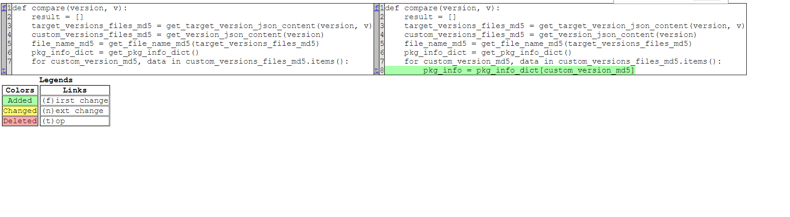

## 												使用说明

##### 1、files_diff  这个包是根据 Python内置包 filecmp 修改而来,主要是把  filecmp  中的下面的方法

```python
class dircmp:
    def report(self): # Print a report on the differences between a and b
        # Output format is purposely lousy
        print('diff', self.left, self.right)
        if self.left_only:
            self.left_only.sort()
            print('Only in', self.left, ':', self.left_only)
        if self.right_only:
            self.right_only.sort()
            print('Only in', self.right, ':', self.right_only)
        if self.same_files:
            self.same_files.sort()
            print('Identical files :', self.same_files)
        if self.diff_files:
            self.diff_files.sort()
            print('Differing files :', self.diff_files)
        if self.funny_files:
            self.funny_files.sort()
            print('Trouble with common files :', self.funny_files)
        if self.common_dirs:
            self.common_dirs.sort()
            print('Common subdirectories :', self.common_dirs)
        if self.common_funny:
            self.common_funny.sort()
            print('Common funny cases :', self.common_funny)

    def report_partial_closure(self): # Print reports on self and on subdirs
        self.report()
        for sd in self.subdirs.values():
            print()
            sd.report()
```

##### 修改为:

```python
class FileCompDiff:
    
    def phase4(self):
        self.subdirs = {}
        for x in self.common_dirs:
            a_x = os.path.join(self.left, x)
            b_x = os.path.join(self.right, x)
            # 保证这里添加的对象是当前类的实例
            self.subdirs[x] = FileCompDiff(a_x, b_x, self.ignore, self.hide)
    
    def report(self):
        print('diff', self.left, self.right)
        if self.diff_files:
            self.diff_files.sort()
        print("==========>>>")
        print('Differing files :', self.diff_files)
        print("==========>>>")
        diff_info = None
        if self.diff_files:
            diff_info = {
                f"{self.left} Diff-To {self.right}": self.diff_files
            }
        return diff_info
    
    def rec_report_full_closure(self):
        infos = list()
        diff_info = self.report()
        if diff_info:
            # 如果有,添加至冲突列表中
            infos.append(diff_info)
        for st in self.subdirs.values():
            # 关键在于这里遍历出来的st不是当前类的对象
            # 递归执行子目录,注意返回的是一个列表
            sub_diff_info = st.rec_report_full_closure()
            if sub_diff_info:
                # 如果有,添加至冲突列表中
                infos.extend(sub_diff_info)
        return infos
```


之所以这么修改,是因为实际需求是需要检测两个不同目录下的文件是否存在不一致的地方,实际就是Beyond Compare 这一类文件对比工具的脚本实现。因为需要检测的目录很多，所以改动了Python的 filecmp 内置包 ,实现实际需求。

##### 2、使用示例

```python
from file_diff_cmp import DEFAULT_IGNORES, FileCompDiff
# DEFAULT_IGNORES 列表,可以设置哪些文件不需要进行对比检测
DEFAULT_IGNORES.append("version")
# 指定对比的两个目录 path1 path2
diff_obj = FileCompDiff(path1, path2, ignore=DEFAULT_IGNORES)
# 返回一个列表,列表元素是存在差异的对比文件
diff_infos = diff_obj.rec_report_full_closure()
```

##### 3、生成表格

```python
    def save_diff_xlsx_report(path, path1, path2, pkg_name1, pkg_name2):
        """生成表格"""
        # version文件不进行比较
        DEFAULT_IGNORES.append("version")
        diff_obj = FileCompDiff(path1, path2, ignore=DEFAULT_IGNORES)
        diff_infos = diff_obj.rec_report_full_closure()
        infos = list()
        if diff_infos:
            for diff_info in diff_infos:
                dir_path = [k for k in diff_info.keys()][0]
                pathA = dir_path.split(" Diff-To ")[0]
                pathB = dir_path.split(" Diff-To ")[1]

                file_paths = [v for v in diff_info.values()][0]
                for file_path in file_paths:
                    fileA = "/".join([pathA, file_path])
                    fileB = "/".join([pathB, file_path])
                    info = {
                        "A": "5.8.5-5.9.0-security",
                        "B": "custom-vpc-999018091801",
                        "冲突文件": file_path,
                        "A冲突文件位置": fileA,
                        "B冲突文件位置": fileB,
                    }
                    infos.append(info)

        pd_obj = pandas.DataFrame(infos)
        pd_obj.to_excel("A与B文件差异表.xlsx", index=None)
    
    
    path = os.path.join(os.getcwd(), "doc")
    path1 = r"D:\git_pro\files_diff\A"
    path2 = r"D:\git_pro\files_diff\B"
    pkg_name1 = "A"
    pkg_name2 = "B"
    save_diff_xlsx_report(path, path1, path2, pkg_name1, pkg_name2)
```

生成的表格:


##### 4、生成html对比报告

```python
# coding:utf-8
import os
import sys
import time
import difflib

from file_diff_cmp import DEFAULT_IGNORES, FileCompDiff


class FileComparer:

    def __init__(self):
        pass

    def get_all_dirs_name(self, path):
        """获取指定路径下的子目录名,返回列表"""
        for dir_path, dir_names, filenames in os.walk(path):
            return dir_names

    def read_file(self, filename):
        """读取文件，并处理"""
        try:
            with open(filename, "r", encoding="utf-8") as fp:
                text = fp.read().splitlines()
            return text
        except (IOError, UnicodeDecodeError) as e:
            print(f"Read file error: {e}")
            # 使用数字进行标识,便于后续的退出判定
            return 2

    def write_file(self, path, filename, pkg_name1, pkg_name2):
        """写入文件,生成对比报告"""
        timestamp = time.strftime("%Y-%m-%d-%H-%M-%S", time.localtime())
        version_no_html = "-".join([path, "HTML"])
        if not os.path.exists(version_no_html):
            os.mkdir(version_no_html)

        title = "{pkg_name1}-diff-to-{pkg_name2}-{timestamp}.html".format(
            pkg_name1=pkg_name1, pkg_name2=pkg_name2, timestamp=timestamp)
        comp_report_title = "/".join([version_no_html, title])
        with open(comp_report_title, "w", encoding="utf-8") as fp:
            fp.write("<meta charset='UTF-8'>")
            fp.write(filename)
            fp_path = os.path.abspath(str(fp.name))
            # 存储位置
            print("The file on {}".format(fp_path))

    def comp_file_content_diff(self, path, file1, file2, pkg_name1, pkg_name2):
        """比较两个文件内容的差异:二进制文件无法进行下面的html报告生成"""
        tf1 = self.read_file(file1)
        tf2 = self.read_file(file2)
        tf1_case = bool(tf1 == 2)
        tf2_case = bool(tf2 == 2)
        if any([tf1_case, tf2_case]):
            return 3

        # 创建一个实例 HtmlDiff
        d = difflib.HtmlDiff()
        # 生成一个比较后的报告文件，格式为html
        filename = d.make_file(tf1, tf2)
        self.write_file(path, filename, pkg_name1, pkg_name2)

    def save_diff_ret_html(self, path, path1, path2, pkg_name1, pkg_name2):
        """比较两个pkg:冲突检测,最后生成冲突文件的html格式报告"""

        # version文件不进行比较
        DEFAULT_IGNORES.append("version")
        diff_obj = FileCompDiff(path1, path2, ignore=DEFAULT_IGNORES)
        diff_infos = diff_obj.rec_report_full_closure()
        if diff_infos:
            for diff_info in diff_infos:
                dir_path = [k for k in diff_info.keys()][0]
                pathA = dir_path.split(" Diff-To ")[0]
                pathB = dir_path.split(" Diff-To ")[1]

                file_paths = [v for v in diff_info.values()][0]
                for file_path in file_paths:
                    fileA = "/".join([pathA, file_path])
                    fileB = "/".join([pathB, file_path])
                    # 二进制文件无法进行下面的html报告生成
                    self.comp_file_content_diff(path, fileA, fileB,
                                                pkg_name1, pkg_name2)
                    time.sleep(1)

    def save_diff_xlsx_report(self, path, path1, path2, pkg_name1, pkg_name2):
        """生成表格"""
        # version文件不进行比较
        DEFAULT_IGNORES.append("version")
        diff_obj = FileCompDiff(path1, path2, ignore=DEFAULT_IGNORES)
        diff_infos = diff_obj.rec_report_full_closure()
        infos = list()
        if diff_infos:
            for diff_info in diff_infos:
                dir_path = [k for k in diff_info.keys()][0]
                pathA = dir_path.split(" Diff-To ")[0]
                pathB = dir_path.split(" Diff-To ")[1]

                file_paths = [v for v in diff_info.values()][0]
                for file_path in file_paths:
                    fileA = "/".join([pathA, file_path])
                    fileB = "/".join([pathB, file_path])
                    info = {
                        "A": "5.8.5-5.9.0-security",
                        "B": "custom-vpc-999018091801",
                        "冲突文件": file_path,
                        "A冲突文件位置": fileA,
                        "B冲突文件位置": fileB,
                    }
                    infos.append(info)

        pd_obj = pandas.DataFrame(infos)
        pd_obj.to_excel("A与B文件差异表.xlsx", index=None)


def main():
    comparer = FileComparer()
    path = os.path.join(os.getcwd(), "doc")
    path1 = r"D:\git_pro\files_diff\A"
    path2 = r"D:\git_pro\files_diff\B"
    pkg_name1 = "A"
    pkg_name2 = "B"
    comparer.save_diff_ret_html(path, path1, path2, pkg_name1, pkg_name2)


if __name__ == '__main__':
    main()

```

生成的html报告:


报告内容:



